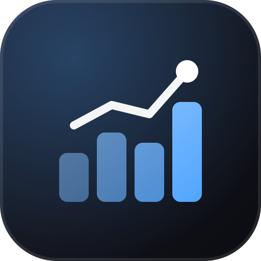

<div align="center">



# LinkedIn Insights

**Turn your LinkedIn analytics export into a dashboard for people who post.**<br>
Best day to post, topics that perform, momentum and "double win" posts. Everything runs in your browser. Nothing is uploaded.

[](https://linkedin-insights-eight.vercel.app)

[](https://github.com/obrenoalvim/linkedin-insights/actions/workflows/ci.yml)
[](LICENSE)
[](https://github.com/obrenoalvim/linkedin-insights/stargazers)
[](#features)

**English** · [Português](README.pt.md)

[Features](#features) · [Getting started](#getting-started) · [Tech stack](#tech-stack) · [Design notes](#design-notes) · [FAQ](#faq)

</div>

---

**Sinal** turns LinkedIn's own "Content analytics" export (`AggregateAnalytics_*.xlsx`) into a
dashboard built for people who post. It goes beyond impressions and follower counts to the
questions a creator actually has: which day of the week should I post on, which topics land,
which posts punch above their weight.

Everything runs in your browser. The `.xlsx` is parsed client-side with SheetJS. Nothing is
uploaded anywhere, and there's no backend at all.

## Features

- **Overview stats**: impressions, reach, followers, engagement rate for the exported period.
- **Best day to post**: average engagement rate by weekday, compared against how often you
  actually post on each day.
- **Momentum**: last 7 days vs. the previous 7, so you can tell if reach is trending up or down.
- **Reach efficiency**: impressions per follower, a rough signal of reach beyond your own network.
- **Topics that perform**: hashtags extracted straight from each post's URL, ranked by average
  engagement and average impressions.
- **"Double win" posts**: posts that land in both the top-engagement and top-impressions lists
  at once.
- **Longest posting gap**, top posts tables, and audience demographics (company, seniority,
  industry, location...).
- **Any export locale**: sheet names, date order (`DD/MM` vs `MM/DD`) and percentage formatting
  ("< 1%" vs "menos de 1%") are all detected automatically; tested against both English and
  Portuguese (Brazil) exports.
- Dark/light mode, no account, no tracking.

## Getting started

Try it without installing anything: open the [live demo](https://linkedin-insights-eight.vercel.app) and drop your `.xlsx` on the page.

To run it locally:

```bash
npm install
npm run dev
```

Open [http://localhost:5173](http://localhost:5173), then drop your `.xlsx` on the page (or click
"Selecionar arquivo").

Get the export from LinkedIn: your profile → **Analytics** → **Content analytics** → **Export**
(last 90 days, or up to a year on some accounts).

## Tech stack

- **Vite + React 19 + TypeScript**
- **Tailwind CSS v4** with a small copy-in UI kit (`src/components/ui`)
- **[xlsx (SheetJS)](https://sheetjs.com/)**: parses the export in the browser (the official
  CDN build, not the vulnerable npm package)
- **[Recharts](https://recharts.org)** for the charts
- **Zod** to validate/normalize the numbers coming out of the spreadsheet
- **Vitest** for unit tests

## Project structure

```
src/
  lib/
    linkedin-export.ts   # parses the 5 export sheets (position-based, locale-agnostic)
    dates.ts              # detects DD/MM vs MM/DD per file and normalizes to local ISO
    weekday-insights.ts, topics.ts, extra-insights.ts
    format.ts              # pt-BR number/date/percent formatting
  components/
    file-drop.tsx           # upload / drag-and-drop screen
    engagement-chart.tsx, followers-chart.tsx, weekday-chart.tsx, topics-chart.tsx
    extra-insights.tsx, top-posts.tsx, demographics.tsx
    stat-tile.tsx, insight-card.tsx, chart-card.tsx, chart-tooltip.tsx, bar-list.tsx
    ui/                       # copy-in kit inherited from front-template-react
  pages/dashboard.tsx        # owns state (file loaded or not) and page layout
```

## Scripts

| Script              | Purpose                      |
| ------------------- | ---------------------------- |
| `npm run dev`       | Start dev server             |
| `npm run build`     | Production build             |
| `npm run preview`   | Preview the production build |
| `npm run lint`      | oxlint + Prettier check      |
| `npm run format`    | Format with Prettier         |
| `npm run test:unit` | Vitest                       |

## Design notes

- **Started from `front-template-react`**, then stripped everything that template needed but a
  single-screen local tool doesn't: auth, multi-locale i18n, TanStack Query, zustand,
  react-hook-form, react-router. What was left (Tailwind v4, the copy-in UI kit, dark mode, a
  sortable/paginated `Table`) was reused as-is.
- **No dual-axis charts.** Impressions and engagements sit on very different scales (hundreds vs.
  tens), so instead of one chart with two Y axes (a dataviz anti-pattern), "Impressions per day"
  and "Engagement rate per day" are two small-multiple charts sharing the same X axis.
- **Chart palette** is a pre-validated categorical/sequential palette (checked for contrast and
  deuteranopia/protanopia safety), not picked by eye. See `--series-1..8` in `src/index.css`.
- **Locale-proof parser.** LinkedIn ships the exact same sheet layout across every export
  language, only the labels change. So `linkedin-export.ts` reads sheets by position instead of
  matching English names, detects date order (`DD/MM` vs `MM/DD`) by scanning every date in the
  file for a value over 12, and extracts percentages by regex instead of matching words like
  "less than". A bare `YYYY-MM-DD` also gets an explicit local-time suffix, otherwise it parses
  as UTC midnight and rolls back a day in negative-UTC timezones (Brazil included).
- **Topic extraction is a heuristic.** LinkedIn encodes a post's hashtags in its URL slug
  (`.../author_tag-one-tag-two-share-123`); `topics.ts` splits on that, so it only sees hashtags
  used on posts that made the Top Posts lists (max ~50 each), not your full post history.

---

## FAQ

**Is my data uploaded anywhere?**
No. The `.xlsx` is parsed in your browser with SheetJS, and there is no backend.

**Where do I get the export?**
On LinkedIn: your profile, then **Analytics**, **Content analytics**, **Export**. It covers the last 90 days, or up to a year on some accounts.

**Does it work with a Portuguese or other-language export?**
Yes. The parser reads sheets by position, so it works across export languages. It was tested with English and Portuguese (Brazil) exports.

**Why do the topic rankings only cover some of my posts?**
LinkedIn puts a post's hashtags in its URL, and only posts that made the Top Posts lists (about 50 each) are in the export. See the design notes.

## More creator tools by the same author

- [**github-wrapped**](https://github.com/obrenoalvim/github-wrapped): a Spotify-Wrapped-style poster for your GitHub year.
- [**youtube-live-analyzer**](https://github.com/obrenoalvim/youtube-live-analyzer): reads YouTube live chat and shows the topics people discuss.
- [**spoti-paper**](https://github.com/obrenoalvim/spoti-paper): creates wallpapers from your favorite Spotify tracks.

## Contributing

Found a bug or an export that breaks the parser? Open an issue or a PR. See [CONTRIBUTING.md](CONTRIBUTING.md) and the [changelog](CHANGELOG.md).

## License

[MIT](LICENSE)

---

<div align="center">

If this told you the best day to post, a ⭐ helps other creators find it.

<sub>**Topics:** linkedin · linkedin-analytics · content-analytics · creator-tools · dashboard · data-visualization · privacy · client-side · react · recharts · xlsx</sub>

</div>
